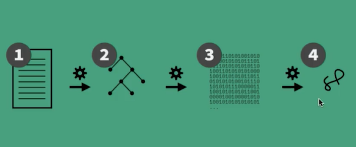
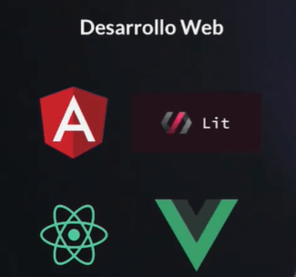
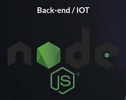
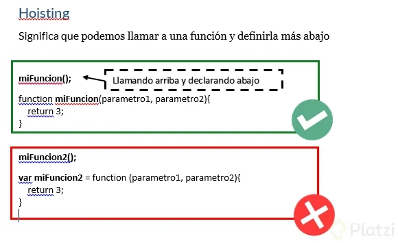
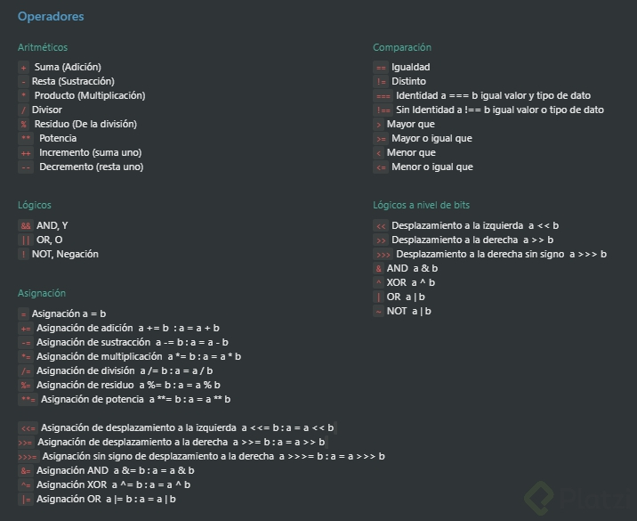

# Apuntes de Curso Básico de JavaScript.
By: Diego de Granda, Platzi.


## ¿Qué es javascript?

<br>

### ¿Cómo nace Javascript?
> Nace con la necesidad de generar dinamismo en las páginas web y que a su vez los usuarios y las empresas pudieran interactuar unos con otros.

<br>

### ¿Qué es javascript?
> Es un lenguaje interpretado, orientado a objetos, débilmente tipado y dinámico.

<br>

### Orientado a objetos.
> Javascript tambien es un lenguaje orientado a objetos, esto quiere decir que podremos crear objetos para representar una entidad (objeto, persona, etc).

<br>

### Ejemplos de débilmente tipado.
```js
    4 * "7"         // 28
    4 + "7"         // 47
    2 + true        // 3
    false - 3       // -3
```

<br>

### Dinámico


Javascript es dinámico, ya que no necesita de un compilador para que el código javascript pueda correr en el navegador, A medida que vayamos interactuando, el código javascript será leído y traducido por la máquina.

<br>

### Motor de Javascript v8


> 1. Toma el código javascript.
> 1. Génera un árbol de palabras claves javascript para poder entender lo que queramos hacer.
> 1. Interpreta nuestro código a bytecode.
> 1. Traé el resultado de la compilación.

<br>

### Backwards y Forwards
>  Forwards: Ser compatible con versiones futuras quiere decir que al implementar funcionalidades nuevas del leguaje no daña nuestro código y se puede usan en versiones anteriores del motor de compilación.

> Javascript es Backwards, esto quiere decir que todas las versiones nuevas no van a romper tu código, sin embargo, no vas a poder usarlas en dicho proyecto, pero para poder utilizarlas, podemos usar herramientas como: **BABEL** ya que estas traducen el código de nuevas versiones a versiones estándares que entiende el navegador.

<br><br>
## ¿Por qué javascript?

<br>

> JavaScript tiene una comunidad enorme de desarrolladores que te pueden ir ayudando a generar diferentes cosas. A continuación nos enfocaremos en las áreas que puedes aplicar para aprenderlo.

<br>

**Desarrollo Web**

Para construir aplicaciones web, existen librerías o frameworks robustos basados en JavaScript. Algunos de estos son: Angular, React o Vue.



<br>

**Desarrollo de aplicaciones**

Si el desarrollo web no es lo tuyo, también puedes utilizar JavaScript para construir aplicaciones nativas. React Native es un framework que te permite construir aplicaciones nativas en Android o iOS.


<br>

**Desarrollo de apps para escritorio**

Electron es un framework que te permite construir aplicaciones de escritorio en Mac o Windows.


<br>

**Backend o Internet of Things (IOT)**

Node.js es un entorno de ejecución de JavaScript del lado del servidor. Este te permite manejar las solicitudes y respuestas que el navegador recibe por medio del usuario, este componente se lo conoce como Backend, mientras que todas las interacciones con el usuario se denomina Frontend.

Igualmente, puedes construir aplicaciones dedicadas al IOT (Internet of Things), que te permite relacionar objetos cotidianos con el internet.




<br><br>

## Elementos de un Lenguaje de Programación: Variables, Funciones y Sintaxis.

<br>

### Dos componentes principales.
> 1. Data que guardamos en memoria.
> 1. Tareas (funciones) que haremos con esa data.

<br>

### Tipos de datos en Javascript.


**Nota:** Para verificar que tipo de dato es un valor se puede utilizar la siguiente palabra reservada: **typeof**, ejemplo:

```js
    // Tipos de datos primitivos
    typeof 5  // 'number'
    typeof "hola" // 'string'
    typeof true  // 'boolean'
    typeof null  // 'object'
    typeof undefined // 'undefined'

    // Tipos de datos de objeto 
    typeof console.log  // 'function'
    typeof {tipo: "objeto"} // 'object'
    typeof [1,2,3,4]  // 'object'
```

<br>

### Variables

> Es la representación de algun lugar en memroia que nosotros vamos a reservar para poder guardar el valor.

> Dentro de JavaScript tenemos tres formas de declarar una variable las cuales son: var, const y let.
> - var: Era la forma en que se declaraban las variables hasta ECMAScript 5. Casi ya no se usa porque es de forma global.
> - const: sirve para declarar variables que nunca van a ser modificadas.
> - Let: Son variables que pueden ser modificadas y su contexto es de bloque.

#### Ejemplo:
```js
    var nombre = "Orlando";

    // Declarar variable
    var edad;

    // Inicializar esa variable
    edad = 23

    var elementos = ["Computadora", "Celular"];

    var persona = {
        nombre: "Orlando",
        edad: 23
    };

    // Acceder a una variable.
    console.log(nombre) //"Orlando"
```

<br>

### ¿Que son las funciones?

> Las funciones son bloques de código que solucionan un problema específico para ser reutilizados. Existen dos tipos de funciones: declarativas y expresivas.

#### ¿Qué son las funciones declarativas?
> En JavaScript, las funciones declarativas se las declara con la palabra reservada function.

> Ejemplo de una función declarativa.

```js
    // Declaración de la función
    function suma(a, b)
    {
        return a + b;
    }

    function otraSuma(a, b)
    {
        console.log(`La suma es ${a+b}`)
    }
```

> La invocación o llamada es la manera que utilizamos las funciones para utilizar el valor de retorno (return) según ciertos argumentos.

```js
    // Invocación de la función
    suma(2,3)

    var resultado1 = suma(2,3)
    var resultado2 = suma(4,6)
    var resultado3 = suma(10,12)
    
    console.log(`Resultado: ${resultado1}`) //5
    console.log(resultado2) //10
    console.log(resultado3) //22
```

#### ¿Qué son las funciones expresivas o anónimas?
> Las funciones expresivas o anónimas consisten en guardar la función en una variable. Tienen la misma declaración e invocación que las funciones declarativas. La diferencia consiste en no especificar un nombre en la función, sino que utiliza el nombre de la variable.

```js
    // Declaración
    var suma = function (a, b) {
        return a + b
    }
    // Invocación
    var resultado = suma(2, 2)

    console.log(resultado) //4
```

#### Diferencias de estas dos tipos de funciones.
> A las funciones declarativas se les aplica hoisting, y a la expresión de función, no. Ya que el hoisting solo se aplica en las palabras reservadas var y function.

> Lo que quiere decir que con las funciones declarativas, podemos mandar llamar la función antes de que ésta sea declarada, y con la expresión de función, no, tendríamos que declararla primero, y después mandarla llamar.




<br><br>

## Scope
> El scope es cada uno de los entornos donde las variables tienen alcance dentro del código de JavaScript. En otras palabras, determina que valor tendrá la variable dependiendo dónde se encuentre.

- Tipos de scope

> Scope Global:
> - Las variables globales son aquellas que se encuentran declaradas fuera de los bloques de código o funciones .El scope global es el entorno donde las variables globales pueden ser accedidas desde cualquier lugar de nuestro programa.

```js
    var nombre = "JavaScript"

    function saludar(){
        console.log("Hola " + nombre)
    }

    saludar()
```

> Scope Local:
> - Las variables locales son aquellas que se encuentran declaradas dentro de los bloques de código o funciones. El scope local es el entorno donde las variables locales solo se pueden acceder desde una función o bloque del programa.

```js
    function saludo() {
        let nombre = "Andres" // scope local
        console.log(nombre)
    }

    saludo() // "Andres"
    console.log(nombre) // ReferenceError: nombre is not defined
```


<br><br>

## Hoisting

> Hoisting es un término para describir que las declaraciones de variables y funciones son desplazadas a la parte superior del scope más cercano, scope global o de función. Esto sucede solamente con las declaraciones y no con las asignaciones.

> El código permanece igual, solo es una interpretación del motor de JavaScript. En el caso de las variables solamente sucede cuando son declaradas con var.

Hoisting en variables declaradas con var

```js
    console.log(nombre) // undefined
    var nombre = "Orlando" 
```
Lo que JavaScript está haciendo sería lo siguiente:

```js
    // Hoisting: Declara y asigna undefined
    var nombre = undefined
    console.log(nombre) // undefined
    nombre = "Orlando"
```
Aquí el nombre de Hoisting o elevación.

<br>
Hoisting en funciones.

```js
    console.log( saludar() )

    function saludar() {
        return "Hola"
    }
```

La respuesta es "Hola", porque al invocar una función que no está declarada, JavaScript la eleva y por eso podemos invocar una función antes de declararla.

```js
    // Hoisting: Declara la función antes de ser invocada
    function saludar() {
    return "Hola"
    }

    console.log( saludar() ) // "Hola"
```

Pero, lo que realmente sucede es que JavaScript guarda la función en memoria en la fase de creación de un contexto de ejecución, no asigna undefined como con las variables.

### Buenas prácticas

> El tema de Hoisting solo sucede con las declaraciones de variables y funciones, por lo que se recomienda declarar las variables y las funciones lo más arriba posible del código, para evitar errores.

> También, el tema de hoisting ya está solucionado con las nuevas formas de declarar variables con let y const.


<br><br>
## Coerción

> La coerción consiste en transformar de un tipo de dato a otro de una variable. Existen dos tipos de coerción: implícita y explícita.


> Coerciones implicitas.
> - Consiste en la transformación de tipos mediante la ayuda de JavaScript. Esto ocurre en operaciones de diferentes tipos, ya que es un lenguaje débil y dinámicamente tipado.

```js
    var a = 4 + "7"
    console.log(typeof a) // string

    var b = 4 * "7"
    console.log(typeof b) // number
```


> Coerciones explicitas.

> - La coerción explícita es la transformación de tipos de datos que controlamos el resultado. Para realizar estas transformaciones utiliza las funciones Number(), String() y Boolean(), para convertir a tipo número, string y lógico, respectivamente.

```js
    Number("47") // 47
    String(51) // "51"
    Boolean(1) // true
```

<br><br>

## Valores: Truthy y Falsy

> Los valores truthy y falsy son valores verdaderos y falsos cuando se realiza una coerción de cualquier tipo a booleano, respectivamente. Esto es importante para manejar condicionales, ya que una estructura condicional evalúa si un valor es verdadero o falso en un contexto booleano.

Falsy
```js
    Boolean() —> sin ningun valor es false
    Boolean(0) —> false
    Boolean(null) —> false
    Boolean(NaN) —> false // NaN es Not and Number
    Boolean(Undefined) —> false
    Boolean(false) —> false
    Boolean("") —> false
```


Truthy

```js
    Boolean(1) —> true //cualquier numero que no sea igual a cero es true
    Boolean(“a”) —> true
    Boolean(" ") —> true // siendo un espacio el valor es true
    Boolean([]) —> true // un array nos da un true
    Boolean({}) —> true // un objeto nos da el valor de true
    Boolean(function() {}) —> true //una funcion tambien es true
    Boolean(true) —> true
```


<br><br>

## Operadores: Asignación, Comparación y Aritméticos
<br>




 <br><br>

 ## Condicionales: If, Else, else if

 > Los condicionales son estructuras de control que te permiten evaluar diferentes expresiones y realizar determinadas acciones en JavasScript.

 Ejemplo de un if

 ```js
    var edad = 17;

    if (edad == 18) {
        console.log("Puedes votar, será tu 1era votacion");
    }
    else if (edad > 18) {
        console.log("Puedes votar de nuevo");
    }
    else {
        console.log("Aun no puedes votar");
    }
 ```

 <br>

 ### Operador ternario
 
 > El operador ternario consiste en evaluar si una expresión es verdadera o falsa. Parecido a un condicional, pero en una línea de código. Esto sirve para evaluar una condición de manera rápida. La estructura que sigue es la siguiente y se lee como: "La condición es verdadera (?), si es así ejecuta el “Bloque verdadero”, caso contrario (:), ejecuta el “Bloque falso”.

 ```js
    function esPar(numero){
        return numero % 2 === 0 ? "Es par" : "No es par"
    }

    esPar(2) // "Es par"
    esPar(3) // "No es par"
 ```


 <br><br>

 ## Switch

> La estructura switch es otra manera de evaluar condiciones, la diferencia con if es que las condiciones deben ser iguales a un caso o algo específico.

> Cuándo utilizar switch
> - Deberías utilizar switch cuando tengas una gran cantidad de casos, que con el condicional if produciría más cantidad de código. El problema con switch es que no es muy utilizado y todo se resuelve con if. Sin embargo, conocer esta estructura te puede permitir escribir código más legible en ciertos casos.

sintaxis:
```js
    function semaforo(color) {
        switch (color) {
            case "verde": 
                console.log("¡Sigue!")
                break;

            case "amarillo": 
                console.log("¡Detente!")
                break;
            
            case "rojo": 
                console.log("¡No puedes avanzar!")
                break;
            
            default: 
                console.log("¡No reconozco ese color! :(")
                break;
        }
}

semaforo("verde") //'¡Sigue!'
```


<br><br>

## Arrays

> Un **Array** es un tipo de estructura de datos, objeto. Puede guardar datos distintos dentro, guarda los datos en forma de lista.

Ejemplo de como declarar un arreglo.
```js
    var frutas = ["Manzana", "Plátano", "Cereza", "Fresa"];
```

Algunas propiedades y métodos de arreglos:

- **.lenght** devuelve la longitud del array.
- **.push()** agrega elementos al final de array.
- **.pop()** elimina un elemento del array.
- **.unshift()** agrega un elemento al array, pero lo agrega en primer lugar.
- **.shift()** elimina el elemento que está en el inicio del array.
- **.indexOf** devuelve la posición de un elemento del array.


<br><br>

## Ciclos

> Los bucles pueden ejecutar un bloque de código varias veces. JavaScript admite diferentes tipos de bucles:

> - for - recorre un bloque de código varias veces
> - for/in - recorre las propiedades de un objeto
> - for/of - recorre los valores de un objeto iterable
> - while - recorre un bloque de código mientras se cumple una condición específica
> - do/while - también recorre un bloque de código mientras se cumple una condición específica

```js
    var estudiantes = ["Maria", "Sergio", "Rosa", "Daniel"];

    function saludarEstudiantes(estudiante) {
    console.log(`Hola, ${estudiante}`);
    }

    for (var i = 0; i < estudiantes.length; i++ ) {
    saludarEstudiantes(estudiantes[i]);
    }

    for (var estudiante of estudiantes) {
    saludarEstudiantes(estudiante);
    }
```

### While

> Para el ciclo while no conocemos la cantidad de veces que la estructura repetirá una o varias instrucciones. Aunque también se puede acoplar para que realice un determinado número de repeticiones.

> Por ejemplo, si queremos que un usuario ingrese un valor mayor a 0, no sabremos cuántas veces se equivocará. También, si queremos que un programa se ejecute hasta que el usuario ingrese una opción para salir.

```js
    var estudiantes = ["Maria", "Sergio", "Rosa", "Daniel"];

    function saludarEstudiantes(estudiante) {
    console.log(`Hola, ${estudiante}`);
    }

    while(estudiantes.length > 0) {
        console.log(estudiantes);
        var estudiante = estudiantes.shift();
        saludarEstudiantes(estudiante);
    }
```


 <br><br>

 ## Objetos.

 > Un objeto es una estructura de datos que permite almacenar valores mediante propiedad - valor a través de la sintaxis de llaves ({}) y separados por comas.

 ¿Qué son los atributos y métodos?

 > En programación orientada a objetos, un objeto es una representación de la realidad, en el cual sus características propias se definen como atributos y sus acciones se definen como métodos.

 > En otras palabras, los atributos son las variables y los métodos son las funciones propias de cada objeto.

 ```js
    var miAuto = {
        marca: "Toyota",
        modelo: "Corolla",
        "año": 2020,
        detalle: function () {
            console.log("Es un auto")
        }
    }   
 ```

 Formas de acceder al valor de un objeto.

```js
    // Notación de corchetes
    objeto["propiedad"]
    miAuto["marca"] // "Toyota"
    miAuto["detalle"]() // "Es un auto"

    // Notación de punto
    objeto.propiedad
    miAuto.marca // "Toyota"
    miAuto.modelo // "Corolla"
    miAuto.añó // 2020
    miAuto.detalle // ƒ detalle()
    miAuto.detalle() // "Es un auto"
 ```


### Cómo generar varios objetos a partir de una función constructora

> Existe un problema al momento de construir varios objetos a partir de un código base, los atributos deben cambiar con respecto a la nueva información. Para esto se utiliza una función constructora.

> Una función constructora sirve para crear varios objetos a partir de nueva información, esto es recibido argumentos.

> Para crear una función constructora, debemos definir los parámetros correspondientes, que serán los atributos del objeto, que cambiarán con la nueva información mediante argumentos. Estos argumentos deben hacer referencia a cada uno del nuevo objeto, esto mediante el objeto contexto this.

Ejemplo:

```js
    function Auto(brand, model, year){
        this.marca = brand
        this.modelo = model
        this.año = year
        this.detalle = function () {
            console.log(`Auto ${this.modelo} del ${this.año}.`)
        }
    }

    var otroAuto = new Auto("Tesla", "Model 3", 2021)
    var otroAuto2 = new Auto("Suzuki", "K-20", 2019)
    var otroAuto3 = new Auto("Ferrari", "Model N", 2018)
```

<br><br>

## Métodos de recorridos de Arrays

> filter : nos permite filtrar solo los elementos que deseamos (según ciertos criterios) y devolverlos en un nuevo array.

> map : crea un nuevo array con los resultados de la llamada a la función indicada aplicados a cada uno de sus elementos.

```js
    var articulos = [
        { nombre: '📱', precio: 1000 },
        { nombre: '💻', precio: 1500 },
        { nombre: '🖥', precio: 2000 },
        { nombre: '⌨️', precio: 100 },
        { nombre: '🖱', precio: 70 },
        { nombre: '🚗', precio: 30000 },
    ];

    // Método Filter
    var articulosFiltrados = articulos.filter(function(articulo) {
        return articulo.precio <= 500;
    });

    // Método Map
    var nombreArticulos = articulos.map(function(articulo) {
        return articulo.nombre;
    });

    articulosFiltrados;
    // (2) [{…}, {…}]
    //   0: {nombre: "⌨️", precio: 100}
    //   1: {nombre: "🖱", precio: 70}

    nombreArticulos; // (5) ["📱", "💻", "🖥", "⌨️", "🚗"]

```