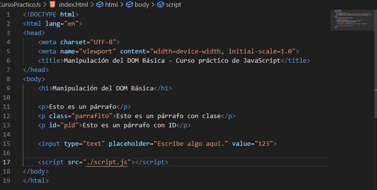
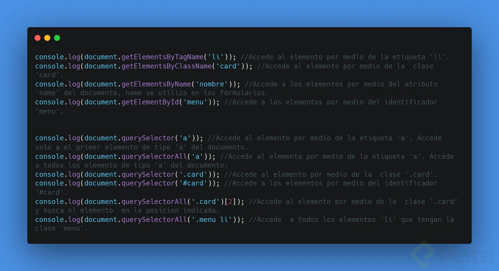

# Apuntes de Curso Práctico de JavaScript.
By: Juan David Castro Gallego, Platzi.

## Como conectar JavaScript con HTML

> Para conectar JavaScript con HTML, hay varias formas de ejecutar. Para ejecutar javascript es importante tener un entorno de ejecución. Estos entornos pueden ser un navegador web y node js.



Nota: Estamos haciendo el entorno de navegación web mediante la etiqueta script.

## Leyendo HTML desde JavaScript

Esta es alguna de las formas en las que se puede leer el HTML mediante JS.

```js
    const h1 = document.querySelector('h1');
    const p = document.querySelector('p');
    const parrafito = document.querySelector('.parrafito');
    const pid = document.querySelector('#pid');
    const input = document.querySelector("input");

    console.log(input.value);

    console.log({
        h1,
        p,
        parrafito,
        pid,
        input
    });
 ```

 

<br><br>

## Escribiendo HTML desde JavaScript

1. InnerHTML

Inserta código en nuestro HTML.

```js
    elemento.innerHTML = 'Nuevo texto';
```

2. InnerText

Inserta únicamente texto plano en tu HTML

```js
    elemento.innerText  = 'Nuevo texto';
```

3. getAttribute()

Lee el valor de un atributo que tiene un elemento cuando indicamos su propiedad en parentesis

```js
    elemento.getAttribute('class');
```

4. setAttribute()

Cambia el valor de un atributo que tiene un elemento cuando le indicamos su nuevo valor en parentesis

```js
    elemento.setAttribute('class', 'nuevo-valor');
```

5. classList.add()

Para agregar un valor a una clase existente en un elemento

```js
    elemento.classList.add('nuevo-valor1');
```

6. classList.remove()

Para eliminar el valor descrito en parentesis a la clase de un elemento

```js
    elemento.classList.remove('nueva-valor1');
```

7. classList.toggle(‘titulo’)

Si tiene un valor descrito entre parentesis se lo quita, o si no lo tiene se lo coloca:

```js
    elemento.classList.toggle('valor');
```

8. classList.contains(‘titulo’)

Devuelve true o false Si una propiedad tiene un valor descrito entre parentesis

```js
    elemento.classList.contains('valor');
```

9. .value = ‘valor’

Colocarle un valor a un elemento, usualmente colocado en inputs

```js
    elemento.value = '12345';
```

10. .createElement()

Crea un elemento HTML ( < img >, < section >, < header >, < div >, etc )

```js
    document.createElement(img);
```

11. .append()

Puede agregar al documento uno o varios elementos creado previamente al agregarlo entre parentesis

```js
    elemento.append(img, img2);
```

12. .appendChild()

Puede agregar al documento solo un elemento creado previamente al agregarlo entre parentesis

```js
    elemento.append(img);
```

<br><br>

## Esuchando eventos desde JS.

```html
    <!DOCTYPE html>
    <html lang="en">
    <head>
        <meta charset="UTF-8">
        <meta name="viewport" content="width=device-width, initial-scale=1.0">
        <title>Manipulación del DOM Básica - Curso práctico de JavaScript</title>
    </head>
    <body>
        <h1 class="verde">Manipulación del DOM Básica</h1>

        <input type="number" id="calculo1" placeholder="Escribe algo aquí.">
        <input type="number" id="calculo2" placeholder="Escribe algo aquí.">

        <button id="btnCalcular" onclick="btnOnClick()">Calcular</button>

        <p id="resultado"></p>

        <script src="./script.js"></script>
    </body>
    </html>

```

```js
    const h1 = document.querySelector('h1');
    const input1 = document.querySelector('#calculo1');
    const input2 = document.querySelector('#calculo2');
    const btn = document.querySelector("#btnCalcular");
    const pResult = document.querySelector("#resultado");

    function btnOnClick() {
    // console.log(parseInt(input1.value) + parseInt(input2.value)); 
    const sumaInputs = input1.value + input2.value;
    pResult.innerHTML = "Resultado: " + sumaInputs;
}
```

<br><br>

## AddEventListener

> Este método sirve para escuchar cualquier tipo de evento que ocurra dentro de un objeto, estos objetos pueden ser un elemento HTML, una ventana, el mismo documento, un XMLhttpRequest.
Los eventos pueden ser:

> - blur: Cuando el elemento pierde el foco.

> - click: El usuario hace clic sobre el elemento.

> - dblclick: El usuario hace doble clic sobre el elemento.

> - focus: El elemento gana el foco.

> - keydown: El usuario presiona una tecla.

> - keypress: El usuario presiona una tecla y la mantiene pulsada.

> - keyup: El usuario libera la tecla.

> - load: El documento termina su carga.

> - mousedown: El usuario presiona el botón del ratón en un elemento.

> - mousemove: El usuario mueve el puntero del ratón sobre un elemento.

> - mouseout: El usuario mueve el puntero fuera de un elemento.

> - mouseover: El usuario mantiene el puntero sobre un elemento.

> - mouseup: El usuario libera el botón pulsado del ratón sobre un elemento.

> - unload: El documento se descarga, bien porque se cierra la ventana, bien porque se navega a otra página.

Sintaxis.
> element.addEventListener(evento, funcion);